<u>**Development of 11KV/433 Volts substation automation scheme using programmable logic controller for timer ON/OFF load operation**</u>

**Aim**: Aim: Development of 11KV/433 Volts substation automation scheme using programmable logic controller for timer ON/OFF load operation and observe the working (Human machine interface) of substation.

**Procedure**:In our experiment, substation is automated using a modular PLC.
Let us see how the human machine interface (HMI). Looks like:

[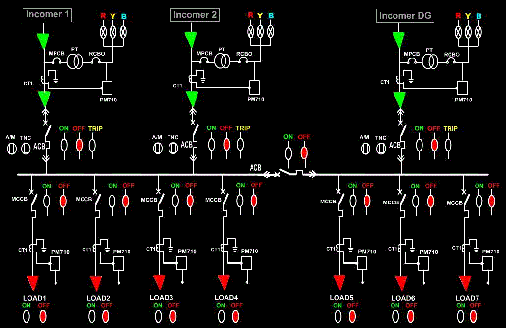](./images/proc1.png)

Here, Incomer1 and Incomer2 is of the same source and it is stepped down from 11KV to 433Volts. IncomerDG is also stepped down from KV to 433 Volts but of different phase.  
Let us assign address for the input and output signals of the PLC:  
Incoming signals to PLC are:-

<ul style="list-style-type: square">
<li>I:1/1 = Incomer2</li>
<li>I:1/0 = Incomer1</li>
<li>I:1/2 = IncomerDG</li>
<li>I:1/3 = Buscoupler</li>
<li>I:1/4 = Load1</li>
<li>I:1/5 = Load2</li>
<li>I:1/6 = Load3</li>
<li>I:1/7 = Load4</li>
<li>I:1/8 = Load5</li>
<li>I:1/9 = Load6</li>
<li>I:1/10 = Load7</li>
</ul>

Outgoing signals of PLC are:-

<ul style="list-style-type: square">
<li>O:2/1 = Incomer1 ON status</li>
<li>O:2/2 = Incomer1 OFF status</li>
<li>O:2/3 = Incomer1 Trip status</li>
<li>O:2/4 = Load1 ON status</li>
<li>O:2/5 = Load1 ON status</li>
<li>O:2/6 = Incomer2 ON status</li>
<li>O:2/7 = Incomer2 OFF status</li>
<li>O:2/8 = Incomer2 Trip status</li>
<li>O:2/9 = Buscoupler OFF status</li>
<li>O:2/10 = Buscoupler ON status</li>
<li>O:2/11 = IncomerDG ON status</li>
<li>O:2/12 = IncomerDG OFF status</li>
<li>O:2/13 = IncomerDG Trip status</li>
<li>O:2/14 = Load2 ON status</li>
<li>O:2/15 = Load2 OFF status</li>
<li>O:3/0 = Load3 ON status</li>
<li>O:3/1 = Load3 OFF status</li>
<li>O:3/2 = Load4 ON status</li>
<li>O:3/3 = Load4 OFF status</li>
<li>O:3/4 = Load5 ON status</li>
<li>O:3/5 = Load5 OFF status</li>
<li>O:3/6 = Load6 ON status</li>
<li>O:3/7 = Load6 OFF status</li>
<li>O:3/8 = Load7 ON status</li>
<li>O:3/9 = Load7 OFF status</li>
<li>O:4/0 = Load1 ON status</li>
<li>O:4/1 = Load1 OFF status</li>
<li>O:4/2 = Load2 ON status</li>
<li>O:4/3 = Load2 OFF status</li>
<li>O:4/4 = Load3 ON status</li>
<li>O:4/5 = Load3 OFF status</li>
<li>O:4/6 = Load4 ON status</li>
<li>O:4/7 = Load4 OFF status</li>
<li>O:4/8 = Load5 ON status</li>
<li>O:4/9 = Load5 OFF status</li>
<li>O:4/10 = Load6 ON status</li>
<li>O:4/11 = Load6 OFF status</li>
<li>O:4/12 = Load7 ON status</li>
<li>O:4/13 = Load7 OFF status</li>
</ul>

<u>Note</u>: Here, CPU resides in slot 0,one 116-bit input module is used and three-16bit output modules are used.

<ul style="list-style-type: circle">
<li>Let us design the ladder logic for the substation:</li>
</ul>

<ul style="list-style-type: square">
<li><u>Incomer1 PLC control scheme of autoclave</u></li>
</ul>

[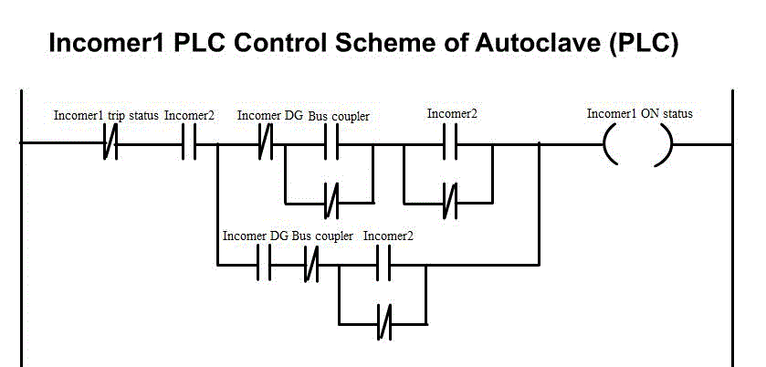](./images/proc2.png)

<ul style="list-style-type: square">
<li><u>Incomer2 PLC control scheme of autoclave</u></li>
</ul>

[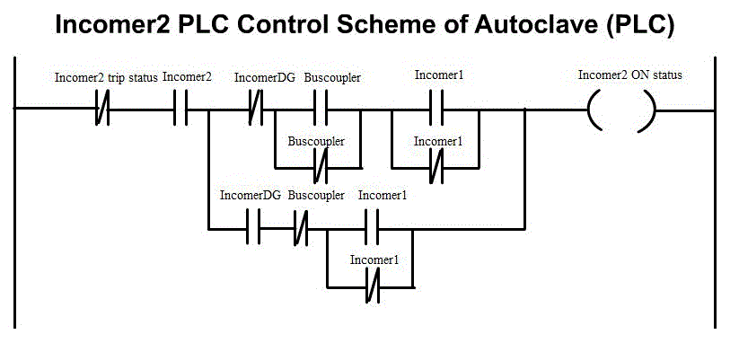](./images/proc3.png)

<ul style="list-style-type: square">
<li><u>Incomer3 PLC control scheme of autoclave</u></li>
</ul>

[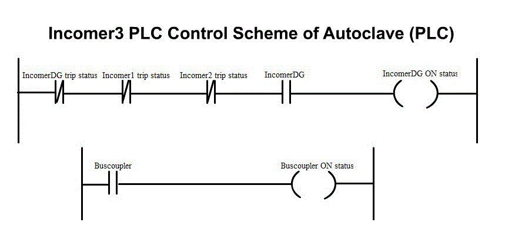](./images/proc4.png)

<ul style="list-style-type: square">
<li><u>The Ladder diagram below is used for OFF status of the incomers</u></li>
</ul>

[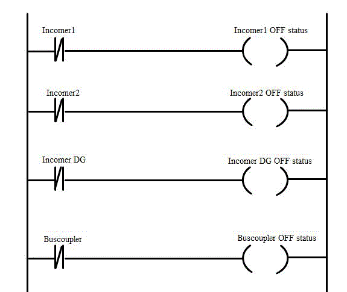](./images/proc5.png)

<ul style="list-style-type: square">
<li><u>PLC control scheme of incomers protection of autoclave(Tripping issues)</u></li>
</ul>

[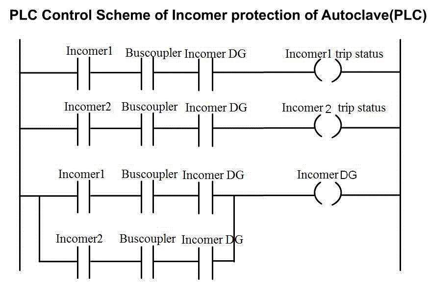](./images/proc6.png)

<ul style="list-style-type: circle">
   <li>Cyclic ON/OFF load control schemes</li>
</ul>

In a 24 hours loading cycle, some consumer wants load to be switched ON in a regular intervals as per their requirement, for example 14 hours ON and remaining 10 hours OFF.  
In order to meet such requirements in every time interval personnel’s should be employed for operation. In the present thesis, for simplicity 10 seconds ON and 5 second OFF time was implemented for Load1. Similarly 8 second ON, and 4 second OFF time was implemented for Load2.

<ul style="list-style-type: circle">
   <li>Ladder logic is designed as follows:</li>
</ul>
<ul style="list-style-type: disc">
   <li>Ladder logic for Load1 is as follows:</li>
</ul>

[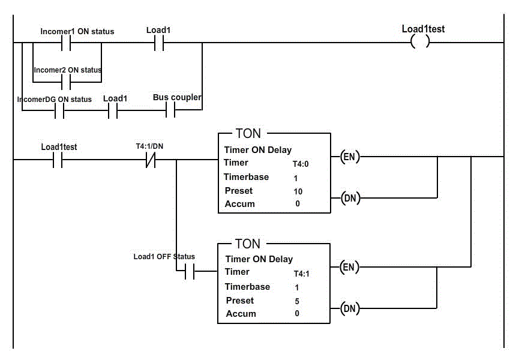](./images/proc7.png)

<ul style="list-style-type: disc">
   <li>Ladder logic for Load2 is as follows:</li>
</ul>

[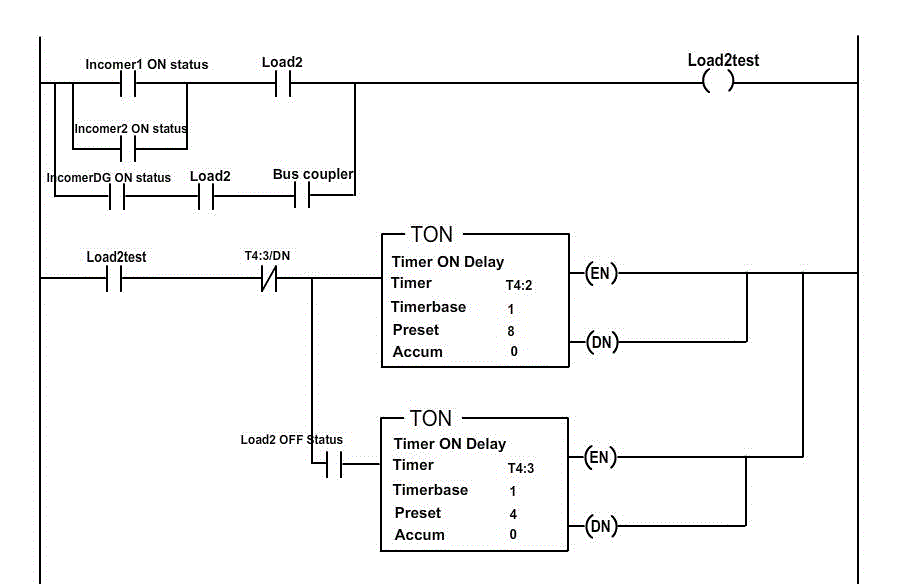](./images/proc9.png)

[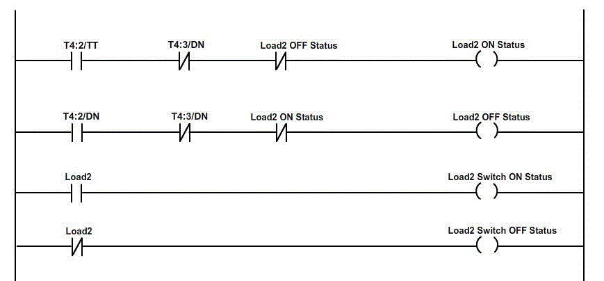](./images/proc10.png)

<ul style="list-style-type: disc">
   <li><u><strong>TIMER ON/OFF LOAD CONTROL SCHEME</strong></u></li>
</ul>

In some other cases of 24 hours loading cycle, some consumer wants load to be switch ON in a single interval as per the requirement, for example 8 hours ON and remaining hours OFF. In order to meet such requirements every day personnel’s should be employed for operation. In the present thesis for simplicity 15 second ON and OFF for the rest of the period was implemented for Load3, similarly 10 second ON and OFF for the rest of the period was implemented for Load4.

<ul style="list-style-type: disc">
   <li><u><strong>Ladder logic is designed as follows:</strong></u></li>
</ul>

<ul style="list-style-type: circle">
   <li>Ladder logic for load3</li>
</ul>

[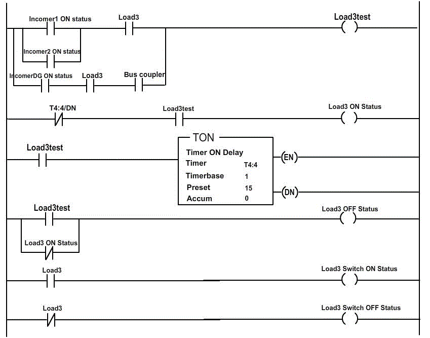](./images/proc11.png)

<ul style="list-style-type: circle">
   <li>Ladder logic for Load4</li>
</ul>

[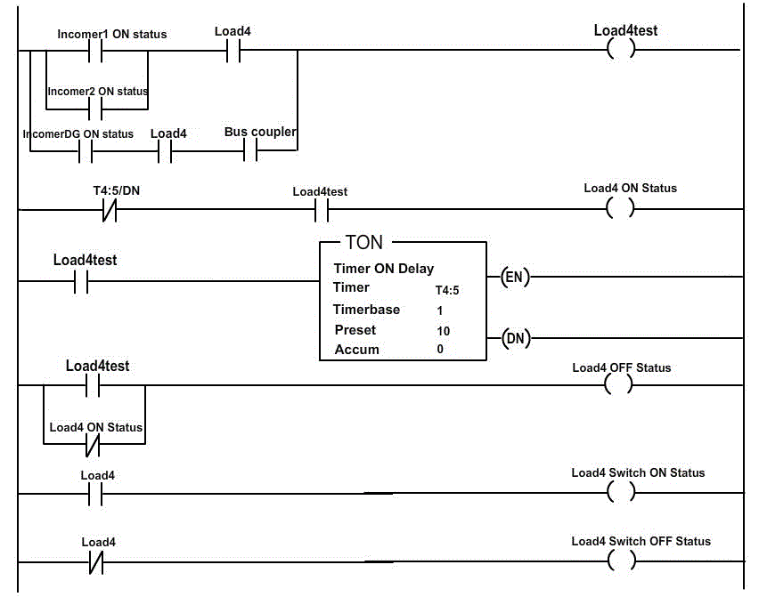](./images/proc12.png)

<ul style="list-style-type: disc">
   <li><u><strong>LADDER LOGIC FOR NORMAL LOADS:</strong></u></li>
</ul>

<ul style="list-style-type: circle">
   <li>Ladder Logic For Load5</li>
</ul>

[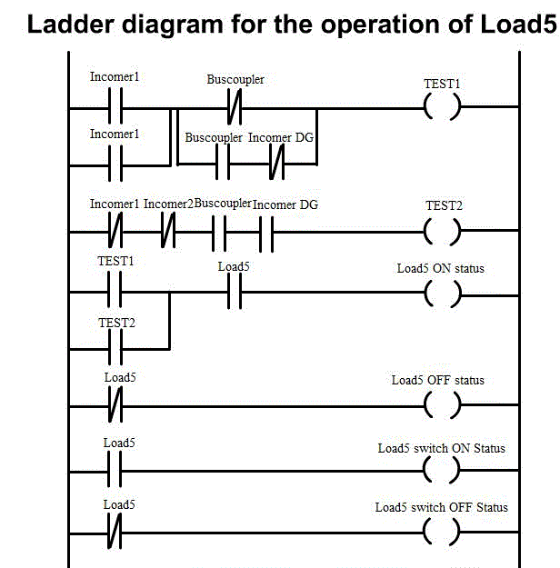](./images/proc13.png)

<ul style="list-style-type: circle">
   <li>Ladder Logic For Load6</li>
</ul>

[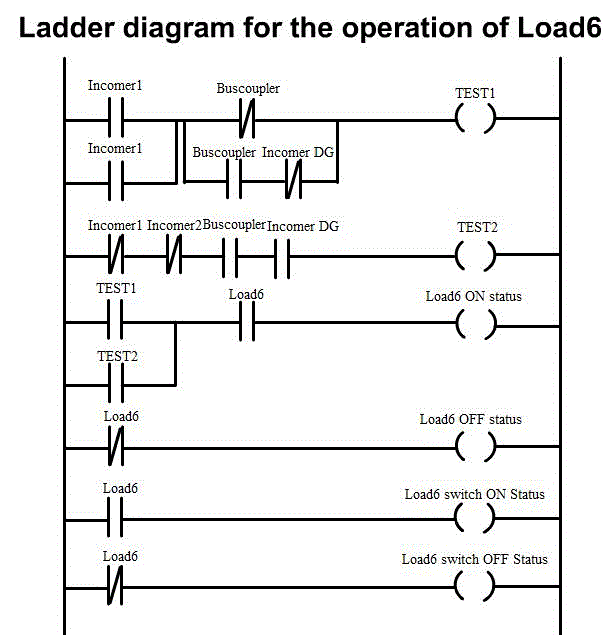](./images/proc14.png)

<ul style="list-style-type: circle">
   <li>Ladder Logic For Load7</li>
</ul>

[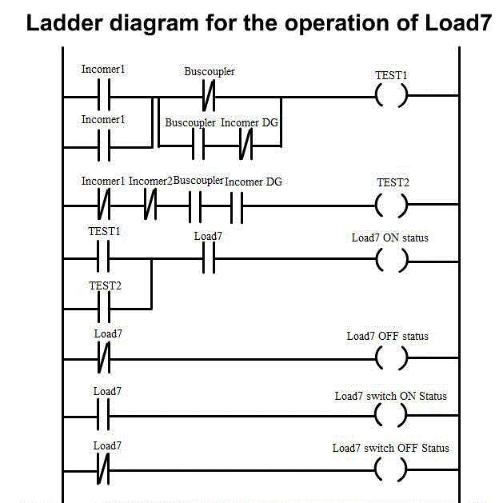](./images/proc15.png)

<ul style="list-style-type: circle">
   <li>In order to understand the working of HMI, click the switches (circuit breaker) i.e. Incomer1, Incomer2, IncomerDG, Load1, Load2, Load3, Load4, Load5, Load6, and Load7.</li>
</ul>
