

A substation is a part of an electrical generation, transmission and distribution system. The assembly of apparatus used to change some characteristics (e.g. voltage, frequency, p.f., A.C. to D.C. etc.) of an electrical supply is called a substation.  
Some of the main operations of substations are:

<ul style="list-style-type: disc">
<li>To receive energy transmitted at high voltage from the generating stations.</li>
<li>To decrease the voltage to a value appropriate for local distribution.</li>
<li>To provide switching facilities.</li>
</ul>

Electric power may flow through several substations between generating plant and consumer, and its voltage may change in several steps.  
Substations generally have switching, protection and control equipment, and transformers. In a large substation, circuit breakers are used to interrupt any short circuits or overload currents that may occur on the network. Smaller distribution stations may use recloser circuit breakers or fuses for protection of distribution circuits. Substations themselves do not usually have generators, although a power plant may have a substation nearby. Other devices such as capacitors and voltage regulators may also be located at a substation.  
Substations may be on the surface in fenced enclosures, underground, or located in special-purpose buildings. High-rise buildings may have several indoor substations. Indoor substations are usually found in urban areas to reduce the noise from the transformers, for reasons of appearance, or to protect switchgear from extreme climate or pollution conditions. Where a substation has a metallic fence, it must be properly grounded to protect people from high voltages that may occur during a fault in the network. Earth faults at a substation can cause a ground potential rise. Currents flowing in the Earth's surface during a fault can cause metal objects to have a significantly different voltage than the ground under a person's feet; this touch potential presents a hazard of electrocution.

<u>**Classifications of substations**</u>:  
Based on service as:

1. Transformer substations.

  <ul style="list-style-type: disc">
    <li>Transmission and primary substation.</li>
    <li>Substation and secondary substation.</li>
    <li>Distribution substation.</li>
  </ul>

2. Switching substation.
3. Industrial substation.
4. Synchronous substation or power factor correction.
5. Frequency changer substation.
6. Based on design as:
7. Indoor type substation.
8. Outdoor substation.

Based on design as:

1. Indoor type substation.
2. Outdoor substation.

<u>Transmission substation</u>:  
A transmission substation connects two or more transmission lines. The simplest case is where all transmission lines have the same voltage. In such cases, the substation contains high-voltage switches that allow lines to be connected or isolated for fault clearance or maintenance. A transmission station may have transformers to convert voltage levels between two transmission voltages, voltage control/power factor correction devices such as capacitors, reactors or static VAr compensators and equipment such as phase shifting transformers, to control power flow between two adjacent power systems. It also contains large amount of protection and control equipment (voltage and current transformers, relays and SCADA systems).

<u>Distribution substation</u>:  
A distribution substation transfers power from the transmission system to the distribution system of an area. It is uneconomical to directly connect electricity consumers to the main transmission network, unless they use large amounts of power, so the distribution station reduces voltage to a value suitable for local distribution.  
The input for a distribution substation is typically at least two transmission or sub-transmission lines. Input voltage may be, for example, 115 kV, or whatever is common in the area. The output is a number of feeders. Distribution voltages are typically medium voltage, between 2.4 and 33 kV, depending on the size of the area served and the practices of the local utility. The feeders run along streets overhead (or underground, in some cases) and power the distribution transformers at or near the customer premises.  
In addition to transforming voltage, distribution substations also isolate faults in either the transmission or distribution systems. Distribution substations are typically the points of voltage regulation, although on long distribution circuits (of several miles/kilometres), voltage regulation equipment may also be installed along the line.

<u>Collector substation</u>:  
In distributed generation projects such as a wind farm, a collector substation may be required. It somewhat resembles a distribution substation although power flow is in the opposite direction, from many wind turbines up into the transmission grid. Usually for economy of construction the collector system operates around 35 kV and the collector substation steps up voltage to a transmission voltage for the grid. The collector substation can also provide power factor correction if it is needed, metering and control of the wind farm. In some special cases a collector substation can also contain an HVDC (high voltage direct current) static inverter plant.  
Collector substations also exist where multiple thermal or hydroelectric power plants of comparable output power are in proximity.

<u>Switching substation</u>:  
A switching substation is a substation which does not contain transformers and operates only at a single voltage level. Switching substations are sometimes used as collector and distribution stations. Sometimes they are used for switching the current to back-up lines or for parallelizing circuits in case of failure.

<u>Transformer substations</u>:  
In power system, most of the sub-stations are concerned with changing of the voltage level of electrical supply (stepping up or stepping down). These are known as transformer substations because transformer is the major component used to change the voltage levels.

[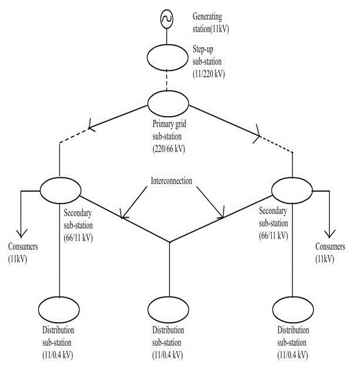](./images/normal1.png)

Fig (a)  
Fig (a) represents the block diagram of typical electric supply system indicating the position of various types of transformer substations.

<u>**Elements of substation**</u>:

[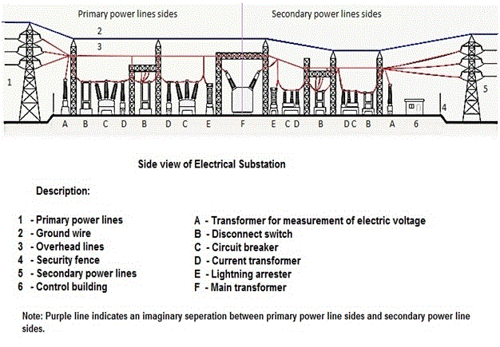](./images/normal2.png)

Fig (b)  
Side view of electrical substation

Let us see few the elements in detail:

<u>**Transmission and distribution of electrical power**</u>

By transmission and distribution of electrical power is meant its conveyance from the central station where it is generated to the places where it is demanded by the consumers (like pumping stations, residential and commercial buildings, mills, factories etc.)

<ul style="list-style-type: disc">
<li>The maximum generated voltage in advanced countries is 33kV while that in India is 11kV.</li>
<li>The amount of power that has to be transmitted through transmission lines is very large and of this power is transmitted at 11kV (or 33kV) the line current and power loss would be very large. Therefore this voltage is stepped up to a higher value by using step up transformers located in sub-stations.</li>
<li>The transmission voltages in India are 400 kV, 220 kV and 132 kV.</li>
<li>The transmission lines and feeders are 3-phase 3-wire circuits.</li>
<li>The distributors are 3-phase 4-wire circuits because a neutral wire is necessary to supply the single-phase loads of domestic and commercial consumers.</li>
<li>The transmission network is commonly known as <strong>Grid</strong>. </li>
</ul>

<u>**Electric supply system**</u>:  
An electric supply system comprises of the following three principle components:

1. Power station.
2. Transmission lines.
3. Distribution lines.

The electrical system is broadly classified as follows:

1. D.C. or A.C. system.
2. Overhead or underground system.

The overhead system is less expensive than the underground one. In our country this system is mostly adopted for transmission and distribution of power.

fig(c)  
The above figure shows a typical layout of power system between generation and use of electric power

<u>The various components are discussed below</u>:

1. <i>Generating station (GS)</i>: In generating station electric power is produced by 3-phase alternators operating in parallel. The normal generation voltage is 11kv (it may be 6.6kV or even 33kV in some cases). This voltage is stepped upto 132kV (or more) with the help of 3-phase transformers. Generally the transmission is carried at 66kV, 132kV, 220kV or 400kV.  
   <strong>Note</strong> :<i> Whereas the use of high voltage leads to several advantages including saving of conductor material and high transmission efficiency, on the other hand, introduces insulation problems and increases cost of switchgear and transformer equipment.</i>
2. <i>Primary transmission</i>: In this type of transmission, the electric power at 132kV is supplied to the other system by 3-phase 3-wire overhead system.
3. <i>Secondary transmission</i>: The primary transmission line terminates at the receiving station (RS) where the voltage is reduced to 33kV by step down transformers. From this station, the electric power is transmitted at 33kV to large consumers by 3-phase, 3-wire overhead system, and this forms the secondary transmission.
4. Primary distribution: The secondary transmission line terminates at sub-stations(SS) where voltage is reduced from 33kV to 11kV. The 11kV(3-phase,3-wire) lines run along the important road sides of the city.  
   <strong>Note</strong>: <i>The large/big consumers(having demand more than 50kw) are normally supplied power at 11kV which they handle it individually with their own substations.</i>
5. <i>Secondary distribution</i>: The electric power available at 11kv from the primary distribution line is delivered to distribution substations (DSS, located near the locality of the consumers) which step down the voltage to 400V, 3-phase, 4-wire secondary distribution. The single phase residential lighting load is connected between any phase and neutral (230V) and 3-phase motor load is connected across 3-phase lines (400V) directly.  
   The secondary distribution system consists of feeders, distributors and service mains (see fig (b))

fig(d)  
Low voltage (L.V.) distribution system

<ul style="list-style-type: disc">
<li><strong>Feeders</strong>: <i>These are line conductors which connect the stations to the areas, to be fed by those stations. Normally no tapping are taken from feeders. They are designed mainly from point of their current carrying capacities.</i></li>
<li><strong>Distributors</strong>: <i>These are conductors from which several tappings for the supply to the consumers are taken. They are designed from the point of view of the voltage drop in them.</i></li>
<li><strong>Service mains</strong>: <i>These are the terminals which connect the consumer’s terminals to the distributors.</i></li>
</ul>

<u>**Comparison between D.C. and A.C. systems of transmission and distribution**</u>  
<u>**D.C. system**</u>:  
Few advantages: The transmission of electric power by high voltage D.C. systems has following advantages over high voltage A.C. system:

<ul style="list-style-type: disc">
<li>DC systems are economical for long distance bulk power transmission by overhead lines.</li>
<li>Simple line construction.</li>
<li>Greater power per conductor.</li>
<li>Ground return is possible.</li>
<li>In DC system, only IR drop is present and IX drop is nil. Therefore voltage regulation problem is much less serious.</li>
<li>The power flow through a DC link is easily reversible and controlled.</li>
<li>In DC transmission, there is no inductance, capacitance, phase displacement and surge problem.</li>
<li>A DC line has less corona loss.</li>
<li>A DC line has reduced interference with communication circuits.</li>
<li>There is no skin effect in DC, X-section of line conductor is therefore fully utilized.</li>
<li>Because of less potential stress and negligible dielectric loss, underground cable can be used.</li>
<li>No stability problems.</li>
<li>No synchronizing difficulties.</li>
<li>In a DC system, potential stress on the insulation is 1/√2 times that in AC system for same working voltage, therefore less insulation is required in DC system.</li>
</ul>

<u>**Disadvantages**</u>
The high voltage DC systems have the following disadvantages:

<ul style="list-style-type: disc">
<li>DC system uses complicated converters and DC switch gear is expensive. Thus installation is costly.</li>
<li>Electric power cannot be generated at high DC voltage due to commutator problems.</li>
<li>In DC system harmonics are generated which require filters.</li>
<li>Converters require considerable reactive power.</li>
<li>Converters do not have overload capability.</li>
</ul>

<u>**AC system**</u>:
Nowadays electrical energy is almost exclusively generated, transmitted and distributed in the form of A.C. Let us see its advantages and disadvantages.

<u>**Advantages**</u>:-

1. In A.C. system, the electric power can be generated at high voltage.
2. Maintenance of substations is easy and comparatively at a lower cost.
3. Stepping-up and stepping down of an A.C voltage can be done easily and efficiently with the help of transformers.

<u>**Disadvantages**</u>:-

1.  There is a need to synchronize the alternators before they are put in parallel.
2.  Transmission line construction is comparatively difficult and the amount of copper required is comparatively more.
3.  In order to avoid corona loss and also to provide adequate amount of insulation in case of overhead lines, more spacing between the conductors is required.
4.  As a result of skin effect, the resistance of the line is increased.
5.  A.C line has capacitance, because of which there is a continues loss of power due to charging current even when the line is open.

<u>Note</u>:-

1. The best method is to use A.C system for generation and distribution purpose and DC system for transmission purpose.
2. By using mercury are rectifiers and thyratrons, it is possible to transmit electric power by DC system, which can convert AC into DC and vice-versa directly at a reasonable cost. These devices can handle 30 Megawatt at 400V.

[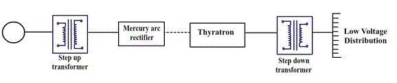](./images/normal5.png)

Fig(e)  
Line diagram of typical H.V.D.C transmission lines

The above figure shows a single line diagram of high voltage DC (H.V.D.C) transmission. The generating station generates electric power which is AC. This voltage is stepped to high voltage by the use of step-up transformers. This A.C power at high voltage is fed to the mercury are rectifiers which converts AC into DC. This high DC voltage is transmitted. At receiving end the DC power converted to AC power using thyratrons. This AC voltage is then stepped down to low voltage for distribution by using a step-down transformer.

<u>**Choice of Transmission Voltage**</u>  
Whenever transmission lines are concerned there is a specific limit for the voltage to be used, beyond which there is no economical profit. The limit is reached when the cost of conductor, transformer, insulator, supports, switchgear, lightning arrester and the erection cost is “minimum”.

Fig(f)

1. According to modern American practice (based on empirical formula) empirical line–to-line voltage (kV) is  
   V=5.5√(0.62l+(3P/100))  
   Where,  
   l=Distance of transmission in km,  
   P=Estimated maximum KW/phase to be delivered over a single circuit.
2. Voltage in kV(line-to-line),  
   V=5.5√(0.62l+(kVA/150))  
   Where,  
   l=Distance of transmission in km and kVA= Total power.

<u>**Underground cables and overhead lines**</u>  
Overhead lines and underground cables are the 2 ways for transmission or distribution of electric power. Most of the time overhead lines are used; underground cables are rarely used for the following reason:

1. Power is generally transmitted over long distances to load centres.
2. Installation costs are very high. Therefore, transmission of power over long distances is carried out by using overhead lines.

<u>**Important components of overhead lines**</u>:

1. <u>Conductors</u>:- Conductors carry power from sending end station to receiving end station.
2. <u>Supports</u>:- These are the structures which keep the conductors at a suitable level above the ground; they can be poles or towers, depending upon the working voltage and the place where they are used.
3. <u>Cross-arms</u>:- Cross arms provide the necessary support to the insulators.
4. <u>Insulators</u>:- They provide insulation to high voltage wire with the metal structure and also provide support to the conductor. They also provide support to bus-bar conductors and other love high voltage equipment terminals.
5. <u>Other miscellaneous items</u>:  
   i. Lightning arresters  
   ii. Fuse  
   iii. Isolating switches  
   iv. Guard wire  
   v. Phase plates  
   vi. Vee guards  
   vii. Anticlimbing wires etc.

<u>**Conductors**</u>  
The following are the characteristics that conductor used for transmission and distribution should possess:

1. In order to withstand mechanical stress, it should have high tensile strength.
2. Low resistivity, so that it has high electrical conductivity.
3. In order to have small weight per unit volume it should have low specific gravity.
4. Low cost.

All these characteristics are not found in a single material. So, while selecting a conductor material for a particular case, a compromise is made between cost and electrical and mechanical properties.

<u>**Material used for transmission lines**</u>  
The most important leading material used for transmission lines is copper because it has tensile strength and high conductivity. Aluminium is also used to large extent especially with a steel core for high voltage line. The selection of materials depends upon the following criteria:

1. Required mechanical strength and electrical properties.
2. Cost of materials.
3. Local conditions.

List of other materials used for transmission lines are:

1. Galvanised steel materials.
2. Galvanised iron.
3. Steel core copper.
4. Cadmium copper materials etc.
5. Phosphor bronze materials etc.

Let us see few of them in brief.

1. <u>Copper</u>:-

  <ul style="list-style-type: disc">
    <li>Copper that has not been annealed after being drawn (Hard drawn copper) conductor is one of the best conductors due to its high electrical conductivity and high tensile strength for all types of transmission. Hard drawing reduces electrical conductivity by a small amount but it increases the tensile strength considerably.</li>
    <li>It is a homogeneous material, durability is high and has high scrap value.</li>
    <li>It has a high current density so lesser X-sectional area of conductor is required.</li>
  </ul>

Copper conductor having steel core are employed for long span transmission lines, where a combination of high conductivity, small sag and minimum cross-section are desired.

2. <u>Aluminium</u>:-  
   i. Lighter in weight as compared to copper, but has smaller conductivity and tensile strength.  
   ii. Aluminium has 1.6 items the resistivity of copper. So for the same loss and length of conductor an aluminium conductor should have 60% greater x-sectional area than that of copper conductor. This increased X-section of aluminium exposes a greater surface to wind pressure. So the supporting towers must be designed for greater transvers strength. As consequences of greater sag, the use of higher towers is often required.  
   iii. The sag in aluminium conductors is greater than the copper conductors.  
   iv. They are particularly suitable for operation in very high ambient temperature.

3. <u>Steel cored aluminium (A.C.S.R)</u>
   Aluminium has low tensile strength, as a result produce greater sag which prohibits their use for longer spans and makes them unsuitable for long distance transmissions. So in order to increase the tensile strength of the aluminium conductor, it is used with a core of galvanized steel wires. The combinational conductor thus obtained is called as A.C.S.R. (Aluminium Conductor Steel Reinforced).

fig(g)  
A.S.C.R conductor

The above figure shows, one steel cored conductor wire surrounded by 18 wires of aluminium. The aluminium carries bulk of current while the steel core takes a greater percentage of mechanical stress.

<ul style="list-style-type: disc">
  <li>Produces small lag and therefore can be used for longer spans.</li>
  <li>A.C.S.R. Conductor gets deteriorated in service due to atmospheric corrosion.</li>
</ul>

4. <u>Galvanised steel</u>

<ul style="list-style-type: disc">
  <li>Used for extremely long spans. Because of poor conductivity and high resistance of steel, they are not suitable for transmitting large power over a long distance.</li>
  <li>Steel wire or iron wire is most advantageous for transmission of small power over a short distance.</li>
</ul>

5. <u>Cadmium copper</u>  
   Sometimes copper alloyed with cadmium is used. When 1 or 2 percentage of cadmium is added to copper it increases the tensile strength by about 40 percentages but reduces the conductivity only by 17 percentages. Cadmium copper is expensive than copper.

<ul style="list-style-type: disc">
  <li>Economical for a line with long spans and small cross-section.</li>
</ul>

<u>**Line support**</u>:-  
The following are the characteristics of line supports used for transmission and distribution of electric power.

<ul style="list-style-type: disc">
  <li>Light in weight and less expensive.</li>
  <li>It should have high mechanical strength.</li>
  <li>Low maintenance cost and longer life.</li>
</ul>

These lines support can be wooden poles, steel poles, RCC poles and steel towers.

1. <u>Wooden poles</u>:
   <ul style="list-style-type: circle">
      <li>Cheap, easily available has insulating properties and are most widely used for distribution purpose in rural areas.</li>
      <li>Used for short spans, up to 60 metres.</li>
      <li>The portion of the poles, which is below the ground level, is impregnated with preservative compounds like creosite oil.</li>
      <li>In order to obtain high transverse strength, double pole structures like ‘A’ or ‘H’ type (fig e) are used.</li>
      <li>Short life, up to 25 to 30 years.</li>
   </ul>

[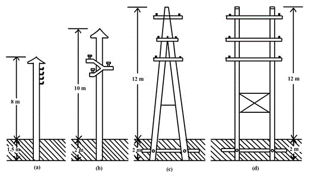](./images/normal8.png)

fig(h)

2.  <u>Steel poles</u>:
    <ul style="list-style-type: circle">
       <li>Has great mechanical strength and thus can be used for longer spans (50-80 metres), but they are costly.</li>
       <li>Majority of 3 types:</li>
      <ol>
      <li>Rail poles </li>
      <li>Rolled steel joints </li>
      <li> Tabular poles </li>
      </ol>  
       <li>Average life more than 40 years.</li>
    </ul>

3.  <u>R.C.C. poles</u>:
    <ul style="list-style-type: circle">
       <li>R.C.C poles possess greater mechanical strength and can be used for longer span than steel poles(80-200 metres).</li>
       <li>Good insulating properties and low maintenance.</li>
       <li>They have a very long life.</li>
    </ul>

[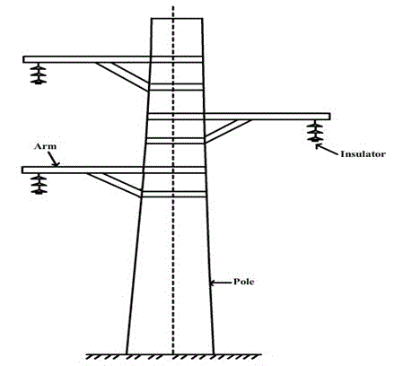](./images/normal9.png)

fig(i)  
R.C.C poles

3.  <u>Steel towers</u>:
    <ul style="list-style-type: circle">
       <li>Wooden poles, steel poles, R.C.C. poles are used for distribution purpose at low voltage (say 11kV), but steel towers are invariably employed for long distance transmission at higher voltage.</li>
       <li>Troubles regarding lightning are minimised as each tower acts as a lightning conductor.</li>
       <li>Steel tower has greater mechanical strength.</li>
       <li>Longer life span.</li>
       <li>Steel towers can withstand most severe climate conditions.</li>
       <li>Steel towers are suitable for longer spans.</li>
    </ul>

[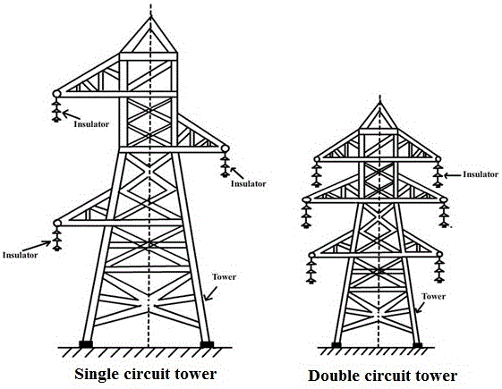](./images/normal10.png)

fig(j)

<u>**OVERHEAD LINE INSULATORS**</u>  
Insulators are used in order to provide safety and necessary clearance between live transmission conductors, which are completely bare and do not have any insulated coating over it.

<u>Required characteristics of an insulator</u>:-

1. It should have insulation resistance to avoid current leakage to earth.
2. It should have very high mechanical strength.
3. It should have high dielectric strength to provide high relative permittivity. Also, it should have high ratio of rapture strength to flash over voltage.

<U>Materials used for insulation</U>

   <ol>
   <li>Porcelain</li>
   <li>Steatite</li>
   <li>Glass</li>
   <li>Synthetic resin</li> 
   </ol>

1. <u>Porcelain</u>
   <ul style="list-style-type: circle">
      <li>Most commonly used material for insulator in overhead lines.</li>
      <li>Porcelain is usually weak in tension and does not withstand tensile strength more than 50MN/m2</li>
      <li>A good porcelain insulator has compressive strength of about 7000N/m2 and dielectric strength of 60kV/cm of its thickness.</li>
      <li>Porcelain is mechanically stronger than glass.</li>   
   </ul>

2. <u>Glass</u>
   <ul style="list-style-type: circle">
      <li>Mainly used for E.H.V, AC and DC systems.</li>
      <li>Glass insulator is cheaper than porcelain when simple shapes are considered.</li>
      <li>Under ordinary atmospheric conditions the glass insulator can be used up to 25kV and in dry atmosphere, it can be used up to 50kV.</li>
      <li>In H.V lines having voltage above 100kV, toughened glass is employed for insulation.</li>
   </ul>

3. <u>Steatite</u>
   <ul style="list-style-type: circle">
      <li>It is produced by mixing hydrated magnesium silicate with small portion of clay and felspar.</li>
      <li>It has high insulation resistance.</li>
      <li>Steatite has much greater tensile and bending stress than porcelain. Thus can be used at tension towers or when the transmission lines take a sharp turn.</li>
   </ul>

4. <u>Synthetic resin</u>
   <ul style="list-style-type: circle">
      <li>Synthetic resin is an insulator which is made up materials like rubber, silicon, resin etc.</li>
      <li>Synthetic resin insulator has high strength and lower weight.</li>
      <li>Leakage current is higher and longevity is low.</li>
      <li>Comparatively cheaper.</li>
      <li>Used in various indoor application.</li>
      <li>Synthetic resin insulators are extensively used for bushings.</li>
   </ul>

<u>Types of insulators</u>

  <ol>
   <li>Pin type insulators.</li>
   <li>Suspension type insulators.</li>
   <li>Strain type insulators.</li>
   <li>Shackle insulators.</li> 
   </ol>

1. <u>Pin type insulators</u>  
   A pin type insulator is designed to be mounted on a pin, which in turn is installed on cross-arm of the pole. The insulator on the pin and electrical conductor is placed in the groove at the top of the insulator and soft aluminium binding wire according to the material of the conductor.

   <ul style="list-style-type: circle">
      <li>Pin type insulators made of glass are generally used for low voltages.</li>
      <li>Pin type insulators made of porcelain can be used up to 90kV but are rarely used on lines above 60kV.</li>
   </ul>

fig(k)  
Pin type insulator

2. <u>Suspension type insulators</u>
   <ul style="list-style-type: disc">
      <li>In a pin type insulator its cost is increased rapidly as the working voltage is increased. Therefore pin type insulator is not economical beyond 33kV. So it is as usual practice to use suspension type insulators for voltage higher than 33kV.</li>
      <li>A pin type insulator sits on top of the cross arm, whereas a suspension insulator hangs from the cross arm. The line conductor is attached to its lower end.</li>
   </ul>

   Few advantages of suspension type insulators over Pin type insulators are:
   <ul style="list-style-type: circle">
      <li>Usually cheaper in cost for operating voltage above 50kV.</li>
      <li>Flexibility is increased with suspension insulators.</li>
      <li>If line insulation needs to be increased, the additional insulators can be easily added to the string. In case there is damage in any insulator, the damaged insulator can be easily replaced.</li>
   </ul>

fig(l)  
Suspension type insulator

fig(m)

3. <u>Strain insulators</u>  
   Strain insulators can be of pin type insulator or suspension type insulator. Strain insulators are made use when making very long spans or corners of transmission lines.

[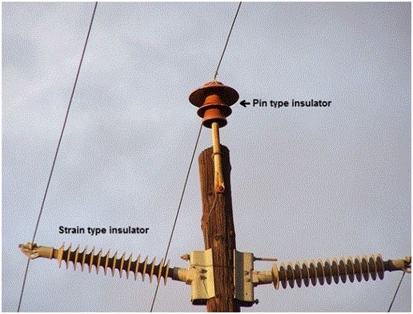](./images/normal14.png)

fig(n)

4. <u>Shackle insulators</u>  
   Shackle insulators can be fixed to a pole directly with a bolt or to the cross arm. The line conductor is fixed in the groove with a soft binding wire. Before, shackle insulators were used as strain insulator, but these days they are used for low voltage distribution lines.

fig(o)  
Shackle insulator

<u>The reason for failure of insulators</u>

1. Mechanical stress
2. Short circuits
3. Flash-over
4. Cracking of insulator, dust deposition, porosity of material etc.

<u>**Sag in overhead lines**</u>:  
In transmission lines, the conductors are supported at the towers or poles. When the conductor supported in this manner it will sag or dip under its own weight and it takes the shape of catenary.  
The distance between the adjacent supporting towers is called the “span”. The difference in level between the points of supports and the lowest points is known as sag.

The factors affecting the sag in overhead lines are:

1. <u>Weight of the conductor</u>: The weight of the conductor directly affects the sag. Heavier the conductor, greater will be the sag.
2. <u>Span length</u>: Sag is directly proportional to the square of the span length, provided other conditions remain unchanged.
3. If other conditions are remaining the same, then the sag is inversely proportional to the working tensile strength.
4. Sag increases with the increase in temperature.

<u>Note</u>:-
Few important terms:

1. <u>Skin effect</u>:  
   When direct currents are concerned, the direct current distributes themselves uniformly over the cross-section of the conductor and therefore use the centre of the conductor as effectively as they use the periphery. When alternating current is concerned, ac owing to inductance effects within the conductor, crowd toward the outside of the conductor. This behaviour is termed as ‘skin effect’. Skin effect raises the apparent resistance of the conducting material, only the total resistance of conductor is changed depending upon the frequency of the current and also the diameter of the conductor. The total resistance of the conductor increases, as the frequency of the current increases, and also increases with the increase in the diameter of the conductor. The current carried by the centre portion of the conductors is reduced by skin effect, thus hollow conductors are sometimes employed to use them more effectively. More often instead of hollow conductor, Aluminium cable steel reinforced (ACSR) is used.  
   The skin effect is negligible when the supply frequency is low (<50Hz) and the conductor diameter is small (<1cm)

2. <u>Proximity Effect</u>:  
   The alternating magnetic flux in a conductor caused by the current following in a neighbouring conductor gives rise to circulating currents which cause an apparent increase in the resistance of a conductor. This phenomenon is called “proximity effect”.  
    Proximity effect is always of negligible order for normal spinning of overhead lines. However, for underground cables where conductors are spaced closely to each other, the effective resistance of the conductor is greatly increased due to proximity effect.

   The factors which effect skin and proximity effects are:-

   1. Frequency of the current.
   2. Permeability of the conductor material.
   3. Size of the conductor and distance between the conductors.

<u>**Classification of transmission lines**</u>  
The transmission lines can be generally classified as follows;

1. Short transmission lines.
2. Medium transmission lines.
3. Long transmission line.

<u>**Short transmission lines**</u>

  <ul style="list-style-type: circle">
      <li>Length less than 50km.</li>
      <li>Operating voltage less than 20kV.</li>
  </ul>

<u>**Medium transmission lines**</u>

   <ul style="list-style-type: circle">
      <li>Length between 50km and 160km.</li>
      <li>Operating voltage is between 21kV and 100kV.</li>
  </ul>

<u>**Long transmission lines**</u>

   <ul style="list-style-type: circle">
      <li>Length more than 160km.</li>
      <li>Operating voltage is above 100kV.</li>
  </ul>

<u>**Bus-bar**</u>  
In electrical power distribution, a bus bar is a strip of <i>copper</i> or <i>aluminium</i> that conducts electricity within a switchboard, distribution board, substation or other electrical apparatus.

The size of the bus bar determines the maximum amount of current that can be safely carried. Bus bars can have a cross-sectional area of as little as 10 mm2 but electrical substations may use metal tubes of 50 mm in diameter (1,963 mm2) or more as bus bars.

Bus bars are typically either flat strips or hollow tubes as these shapes allow heat to dissipate more efficiently due to their high surface area to cross-sectional area ratio. The skin effect makes 50–60 Hz AC bus bars more than about 8 mm (1/3 in) thick inefficient, so hollow or flat shapes are prevalent in higher current applications.

<i>**Note**: Skin effect is the tendency of an alternating electric current (AC) to distribute itself within a conductor with the current density being largest near the surface of the conductor, decreasing at greater depths.</i>

[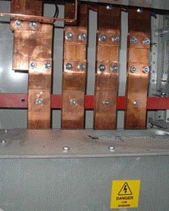](./images/normal16.png)

Fig (p)  
1500 ampere bus bars within a power distribution rack for a large building

A bus bar may either be supported on insulators, or else insulation may completely surround it. Bus bars are protected from accidental contact either by a metal earthed enclosure or by elevation out of normal reach. Neutral bus bars may also be insulated. Earth bus bars are typically bolted directly onto any metal chassis of their enclosure. Busbars may be enclosed in a metal housing, in the form of bus duct or busway, segregated-phase bus, or isolated-phase bus.  
Bus bars may be connected to each other and to electrical apparatus by bolted, clamp, or welded connections. Often joints between high-current bus sections have matching surfaces that are silver-plated to reduce the contact resistance.

Fig (q)  
Solid isolated busbar system

When several feeders or generators operating at the same voltage have to be directly connected electrically, bus-bars are used as the common electrical equipment. The bus-bars provide adequate operating flexibility, cost reduction and sufficient reliability.

Bus-bar arrangements:

   <ul style="list-style-type: circle">
      <li>Single bus-bar system.</li>
      <li>Double bus-bar system with sectionalisation.</li>
   </ul>

<u>Single bus-bar system</u>:  
In case of a power plant which has number of generators and single bus-bar arrangement, the bus-bar is sectionalised by circuit breakers. The major advantage of this type of system is that fault on one part of the bus-bar or system does not completely shut down the whole station.

[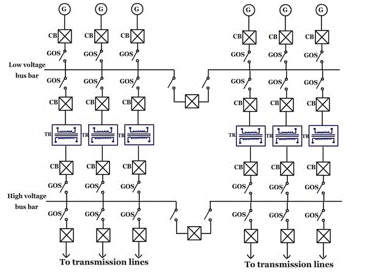](./images/normal18.png)

Fig (r)  
Single bus-bar system

G=generator, GOS= group operated switches, CB=circuit breaker, TR=step up transformer.

<u>Double bus-bar system</u>:  
In this system both low voltage and voltage bus-bars are duplicated, any of the bus-bar sections can be used as desired. There is a provision of a bus-bar coupling switch for transferring operation from one bus-bar to another.

Fig (s)  
Double bus-bar system

Note: Bus coupler is a device which is used switch from one bus to the other without any interruption in power supply and without creating hazardous arcs. It is achieved with the help of circuit breaker and isolators.

<u>**Bushing**</u>  
A bushing is a hollow insulating liner through which a conductor may pass. Bushings appear on switchgear, transformers, circuit breakers and other high voltage equipment.  
The bushing is a hollow insulator, allowing a conductor to pass along its center and connect at both ends to other equipment. Bushings are often made of wet-process fired porcelain, and may be coated with a semi-conducting glaze to assist in equalizing the electrical stress along the length of the bushing.  
The inside of the bushing may contain paper insulation and the bushing is often filled with oil to provide additional insulation. Bushings for medium-voltage and low-voltage apparatus may be made of resins reinforced with paper. The use of polymer bushings for high voltage applications is becoming more common

[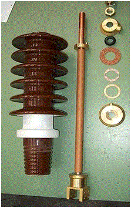](./images/normal20.png)

Fig (t)  
A disassembled bushing. The copper conductor passes up the hollow center of the bushing

<u>Porcelain bushings and big hollow insulators</u>: The hollow insulator, porcelain bushings are used extensively in electrical apparatus. Porcelain bushing is the device that enables one or several conductors to pass through a partition such as a wall or tank and insulates the conductors from it. Big porcelain bushing, hollow insulator upto 1000KV.

[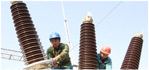](./images/normal21.png)

Fig (u)  
Bushings in SF6 circuit breaker

<u>Small porcelain bushings</u>: Small porcelain bushing, hollow insulators are used as the insulating elements such as the transformer bushings and wall bushings .They are designed to perform under outdoor and indoor conditions for voltage upto 36KV.

[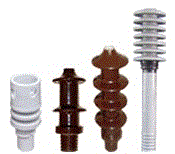](./images/normal22.png)

Fig (v)

[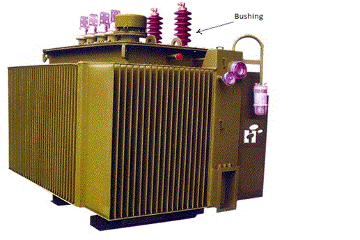](./images/normal23.png)

Fig (w)  
Bushing in transformer

[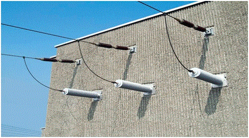](./images/normal24.png)

Fig (x)  
Wall bushing

<u>**Lighting arrestor**</u>  
Lightning arresters are protective devices for limiting surge voltages due to lightning strikes or equipment faults or other events, to prevent damage to equipment and disruption of service. Also called surge arresters.  
Lightning arresters are installed on many different pieces of equipment such as power poles and towers, power transformers, circuit breakers, bus structures, and steel superstructures in substations.

[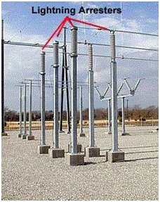](./images/normal25.png)

Fig (y)  
Lighting arrestor on bus structures

[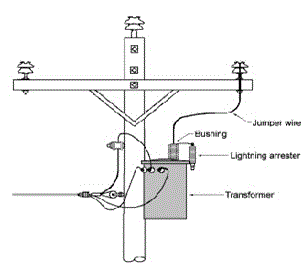](./images/normal26.png)

Fig (z)  
Lighting arrestor on distribution pole transformers

[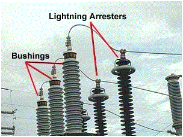](./images/normal27.png)

Fig (1)

[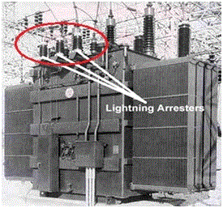](./images/normal28.png)

Fig (2)  
Lighting arrestor on substation power transformer

<u>**Isolator switch (Group operated switches)**</u>  
Isolators are known as disconnector or isolator switch. Isolator is used to make sure that an electrical circuit can be completely de-energized for service or maintenance. Such switches are often found in electrical distribution and industrial applications where machinery must have its source of driving power removed for adjustment or repair. High-voltage isolation switches are used in electrical substations to allow isolation of apparatus such as circuit breakers and transformers, and transmission lines, for maintenance.  
Isolator switches have provisions for a padlock so that inadvertent operation is not possible . In high voltage or complex systems, these padlocks may be part of a trapped-key interlock system to ensure proper sequence of operation. In some designs the isolator switch has the additional ability to earth the isolated circuit thereby providing additional safety. Such an arrangement would apply to circuits which inter-connect power distribution systems where both end of the circuit need to be isolated.  
Isolators are manually operated or motorized. When the isolator is opened, it can be visually seen and hence service men are assured that is safe to work on the isolated equipment. The major difference between an isolator and a circuit breaker is that an isolator is an off-load device intended to be opened only after current has been interrupted by some other control device.

[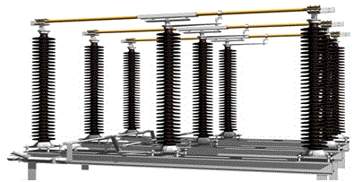](./images/normal29.png)

Fig (3)
110kv isolator in closed position

<u>**Circuit breakers**</u>  
A circuit breaker is an automatically operated electrical switch designed for to protect an electrical circuit from damage caused by overload or short circuit. Or, in other words, the function of a circuit breaker is to isolate the faulty part of the power system in case of abnormal conditions. A protective relay detects abnormal conditions and sends a tripping signal to the circuit breaker. After receiving the trip command signal from the relay the circuit breaker isolates the faulty part of the power system.

[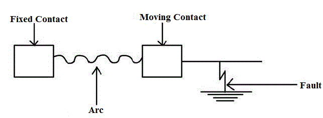](./images/normal30.png)

fig(4)
Separation of the contacts of the circuit breaker

A circuit breaker has two contacts- a fixed contact and a moving contact. Under normal conditions these two contacts remain in closed position. When the circuit breaker is required to isolate the faulty part, the moving contact moves to interrupt the circuit. On the separation of the contacts, the flow of current is interrupted, resulting in the formation of an arc between the contacts. These contacts are placed in a closed chamber containing some insulating medium (like gas or liquid) which extinguish the arc.

Insulating fluid is used for arc extension and the fluid chosen depends upon the rating and type of circuit breaker. The insulating fluids commonly used for circuit breaker are:

1. Air at atmospheric pressure
2. Compressed air
3. Ultra high vacuum
4. Oil which produces hydrogen for arc extension
5. Sulphur hexafluoride (SF6 )

Some of the gases which have been used in circuit breaker are:

<ul style="list-style-type: circle">
   <li>Electromagnetic gases : Sulphur hexafluoride , arcton</li>
   <li>Simple gases: Air, oxygen, hydrogen, nitrogen and carbon dioxide.</li>
</ul>

The important characteristics of the fluids used in circuit breaker are:

1. It should have good thermal and chemical stability.
2. It should have high declarative strength.
3. Non-inflammability and high thermal conductivity.
4. Arc extinguish ability.

<u>**Classification of circuit breakers**</u>

1. High voltage circuit breakers
2. Low voltage circuit breakers

High voltage circuit breakers

1. <u>Oil circuit breakers</u> :-  
   i. Bulk oil circuit breakers using a large quantity of oil.  
   ii. Low oil circuit breakers which operate with a minimum amount of oil.
2. <u>Oil less circuit breakers</u> :-  
   i. Hard gas circuit breakers  
   ii. Air blast circuit breakers  
   iii. Sulphur hexafluoride circuit breaker  
   iv. Water circuit breakers  
   v. Vacuum circuit breakers

<u>**Characteristics of high voltage rating circuit breaker**</u> :-

1. High voltage rating circuit breaker should have high reliability electrically and mechanically.
2. High voltage rating circuit breaker should be capable of interrupting capacitive and inductive circuits and fault currents of all values within their rating.

Let us see some of the features of major circuit breakers:

(1) <u>OIL CIRCUIT BREAKERS (O.C.B)</u>:  
Oil circuit breakers are the most common and oldest type of circuit breakers. The rating range of circuit breakers lies in range of 25MVA at 2.5kV and 5000MVA at 250kV. In oil circuit breaker, the separating contacts are made to separate within insulating oil medium, which has better insulating properties than air.

<u>Few advantages of using oil as an Arc quenching medium</u>:-

1.  Dielectric strength is high
2.  As a result of decomposition of oil, it has good cooling property
3.  It acts as an insulator between live part and earth
4.  Surrounding oil in close proximity to the arc presents a large cooling surface

<u>Few disadvantages</u>:-

1. Highly inflammable and can cause an explosion by mixing with air
2. It requires maintenance
3. Periodic replacement

(2) <u>AIR BLAST CIRCUIT BREAKERS</u>:-  
Air blast circuit breakers is a type of circuit breaker which use a high pressure air blast (at a pressure of 20bar) as an arc quenching medium. Range – 132kV and above up to 400kV ,with the braking capacity up to 7500MVA .But can also be designed to cover the wide range of 66kV to 132kV.

<u>Few advantages</u>:-

1. No risk of explosion and fire hazards
2. Consistent and short arc duration
3. Since the arc duration is short and consistent, the burning of the contact is less due to less arc energy
4. High speed enclosures facility
5. Comparatively less maintenance required

<u>Few disadvantages</u>:-

1. Current chopping
2. Sensitivity to restricting voltage

(3) <u>SULPHUR HEXAFLUORIDE(SF6)CIRCUIT BREAKER</u>:-  
Sulphur hexafluoride to other medium such as oil or air for the use in circuit breakers for the following reasons:

1. Being an Inert gas, it is non-reactive to the other components of circuit breakers
2. Sulphur hexafluoride has high dielectric strength (about 24 times that of air and it is comparable to that of oil)
3. When extinction of arc is concerned it is about 100 times more effective than air
4. Its heat transfer property is about 16times that of air because of its high density

<u>Applications</u>:-

1. The circuit breakers are designed for voltages 115kV to 230kV, power rating of 10MVA to 20MVA and interrupting times less than 3cycles.
2. A typical sulphur hexafluoride circuit breaker consist of interrupter units, each capable of dealing with currents up to 60000A and voltage in the range of 50 to 80kV.A number of units are connected in series according to the voltage of the system.

<u>Few Advantages</u>:-

1. No risk of fire
2. No reduction of dielectric strength
3. Arcing time is very short; this reduces the erosion of contact
4. Its operation is very silent
5. The current chopping tendency is minimized by using sulphur hexafluoride gas at low pressure and low velocity
6. The breaker is compact in size and totally enclosed. Thus electrical clearances are drastically reduced and are particularly suitable where explosion hazard exists, like coal mines

<u>Disadvantages</u>:-

1. Expensive
2. Sulphur hexafluoride gas has to be reconditioned after every operation of the breaker and additional equipment is required for this purpose

(4) <u>VACUUM CIRCUIT BREAKERS(V.C.B)</u>:-  
Vacuum means the pressure below atmospheric pressure which is 760 mm of Hg. In a vacuum circuit breaker, vacuum of the order of 10-5to 10-7 (1 torr = 1 mm of Hg) is used as the arc quenching medium. The dielectric strength of the vacuum is 1000 times more than that of any other medium.

<u>Applications</u>:-

1. Vacuum breakers are being used for outdoor applications ranging from 22kV to 66kV. They are also suitable for majority of applications in several areas even with limited rating say 60 to 100MVA.
2. Vacuum circuit breakers are used for capacitor-bank switching, transformer, reacting switching, where the voltages are high and current to be interrupted is low.

<u>Few important terms regarding circuit breakers</u>:-

1. <u>Arc voltage</u> :-  
   The voltage across the contacts during the arcing period is known as the “arc voltage “.

2. <u>Restriking voltage</u>:-
   The transient voltage appearing across the contacts during arc period is called the “restriking voltage”.

3. <u>Recovery voltage</u>:-
   It is normal frequency (50Hz) r.m.s. voltage that appears across the contact of the circuit breaker after the final extinction. It is approximately equal to the system voltage.

4. <u>Rate of Rise of restriking voltage(RRRV)</u>:-
   The average RRRV = Peak value of restriking voltage/Time taken to reach the peak value

5. <u>Current Chopping</u>:-
   When low inductive current (e.g. current to a shunt reactor or magnetising current of a transformer) is interrupted by a circuit breaker and the arc quenching force of the circuit breaker is more than necessary to interrupt a low magnitude of current, the current will be interrupted before its manual zero instant. It is termed as current chopping.

<u>**Rating of circuit breakers**</u>:-  
A circuit breaker is expected to perform the following duties (besides normal working) under short circuit/fault conditions:

1. To open the contacts to clear the fault and isolating the faulty section.
2. To close the contacts on to a fault.
3. It must be able to carry fault current for a short time while another circuit breaker (in series) is clearing the fault.

Therefore, in addition to the rated voltage, current and frequency, circuit breakers have the following important ratings.

<ol>
   <li>Breaking capacity</li>
   <li>Making capacity</li>
   <li>Short-time capacity</li>
</ol>

1. <u>Breaking capacity</u>:-  
   It is the current (r.m.s. value) that a circuit breaker is capable of breaking under specified conditions (e.g. PPPV, power factor) and given recovery voltage.

Where V=Rated service lines in volts,  
I =rated breaking current (symmetrical or asymmetrical) in ampere.

2. <u>Making capacity</u>:-  
   The peak value of current (including the DC component) during first cycle of current wave after the closure of circuit breaker is known as "making capacity".  
   Making capacity = 2.55 × symmetrical breaking capacity

3. <u>Short-time capacity</u>:-  
   The short time rating of a circuit breaker depends upon its ability to withstand the temperature rise and the electromagnetic force effects. The oil circuit breakers have a specified limit of 3 seconds when the ratio of symmetrical breaking current to the rated normal current does not exceed 40. However if this ratio exceeds 40, then the specified limit is 1second.

<u>Normal current rating</u>:- It is the r.m.s value of current which the circuit breaker is capable of carrying continuously at its rated frequency under specified conditions.

<u>**Transformers**</u>  
The main advantage of alternating currents over direct currents is that, the alternative currents can be easily transferable from low voltage to high or high voltage to low. Alternating voltages can be raised or lowered as per requirements in the different stages of electrical networks as generation, transmission, distribution and utilization. This is possible with a state device called <u>transformer</u>. The transformer works on principle of <u>mutual induction</u>. It transfers an electrical energy from one circuit to other when there is no electrical connection between the two circuits. Thus we can define transformer as below:

<u>Key point</u>: The transformer is a static piece of apparatus by means of which an electrical power is transferred from one alternating current circuit to another with the desired change in voltage and current without any change in frequency.

As an example, see the fig below to see how transformers are used in transmission system:

[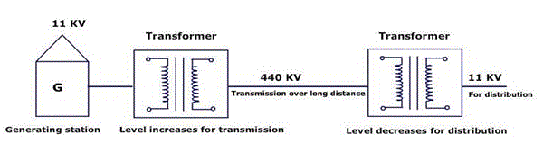](./images/normal32.png)

Basic transformer
Fig (6)

<u>Trivia</u>:- DC supply cannot be used for the transformers.

<u>**Principle of working**</u>  
It works on the principle of mutual induction, mutual induction states that when 2 coils are inductively coupled and if current in one coil is changed informally then an e.m.f. gets induced in the other oil. This e.m.f. can drive a current, when a closed path is provided to it. The transformer works on the same principle.  
The basic transformer is shown in figure below

An alternating voltage source is connected to one of the coils. This coil in which electrical energy is fed with the help of source is called primary winding (p).The other winding is connected to the load. The electrical energy which is transformed to this winding is drawn out to the load. This winding is called secondary winding(s).The primary winding has N1 number of turns while the secondary has N2 number of turns.

Symbolic representation of a transformer
Fig (7)

The secondary voltage depends on the number of turns in primary and secondary winding. The secondary voltage will be having different voltage level but same frequency as the primary.

<u>**Ratios of transformer**</u>

[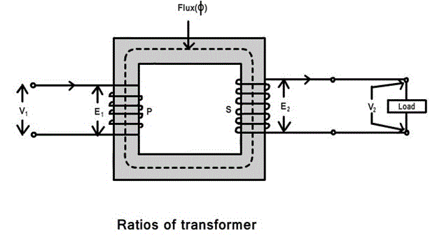](./images/normal34.png)

Fig (8)

<u>**Voltage Ratio**</u>  
The ratio of secondary induced e.m.f. to primary induced e.m.f. is known as voltage transformation ratio denoted as K.

(E2/E1) = (N2/N1) = K

K=(N2/N1)

<u>**Note**</u>:-

1. If N2 > N1 i.e. :K >1
   We get E2 > E1 then the transformer is called step up transformer.
2. If N2 < N1 i.e. :K < 1
   We get E2 < E1 then the transformer is called step down transformer.
3. If N2 = N1 i.e. :K = 1
   We get E2 = E1 then the transformer is called isolation or 1:1 transformer.

<u>**Ideal transformer**</u>
Ideal transformer has following properties:

1. No losses.
2. Windings have zero resistance.
3. All the flex produced by primary links with the secondary i.e. leakage flex is zero.
4. Permeability of core is so high that negligible current is required to establish the flex in it.

<u>**Current ratio**</u>  
In an ideal transformer there are no losses. Therefore the product of primary voltage V1 and primary current I1, is same as the product of secondary voltage V2 and the secondary current I2.  
So V1 I1 = input VA and V2 I2= output VA.  
For an ideal transformer,  
V1 I1 = V2 I2

(V2/V1) = (I2/I1) = K

Therefore the current are in the inverse ratio of the voltage transformative ratio.

<u>**Taps or Tap changer**</u>  
The transformer is provided with a taps in order to adjust the voltage ratio of the transformer. These taps are provided along the winding with connections to a tap-changing device that makes the physical change in the in-service tap. The tap changing device is usually placed on the primary winding to minimize the current to be switched and can be “off-circuit “ or “on-load” type .When the primary voltage is low, the tap changer reduces correspondingly the number of primary turns to maintain the secondary voltage constant. Similarly, when the primary voltage is high, the tap changer increases correspondingly the number of primary turns to maintain the secondary voltage constant.

<u>**Off-circuit taps**</u>  
In industrial power system, off-circuit taps are used with dry-type transformer, liquid-immersed transformer, when they are not connected directly to the utility power supply. On the primary (high voltage side) of step-down transformer, four full-capacity taps (five positions) are provided in four 2.5% steps, 2 above and 2 below normal. The tap-changer mechanism should change the taps on all three phases simultaneously. Also, it should be operable form ground level, with tap changer position for padlocking. Important thing here to be noticed is that the transformer must be de-energized before the tap changer mechanism is operated.

<u>**On-load tap changer**</u>  
On-load tap changers (OLTC) are mostly with oil-immersed transformer connected to the utility power supply at a voltage level exceeding 34.5kV.Because the majority of power companies stipulated a voltage variation of ±10 % in the power contract, the tap changer is provided with an equivalent range of voltage regulation of ±10 % in 16 or 32 steps. 16 step tap changer provides 5/4% voltage change in each step.32step tap changer provides 5/8% voltage change in each step thus more preferred.

When the tap-changer design requires an oil-expansion tank, it shall be piped to a separate compartment in the conservator. A separate tap-changer gas-detector relay is located in this pipe.

The tap-changing control equipment includes:

1. Control and paralleling equipment.
2. Line drop compensation equipment along with the current transformer to provide voltage control at a point remote from the measuring point.
   <ul style="list-style-type: circle">
      <li>Automatic voltage-regulating relay.</li>
      <li>Weather proof control cabinet, accessible from ground level.</li>
   </ul>

<u>**Oil-filled(immersed) transformers**</u>  
Oil filled transformer makes use of oil for the cooling of major parts of a transformer.

fig(9)

Oil filled transformers are transformers filled with a highly refined mineral oil that is used to insulate internal live parts of the transformer. The oil prevents corona and manages temperature control inside the transformer for the prevention of equipment and machinery overheating during the operation of large job applications. Because of oil inside the transformer being of non-combustible properties, these transformers are very safe and can operate machinery for long period of time.

<u>Oil or liquid preservation system for oil-filled transformer</u>  
A preservation system is essential for a liquid-immersed transformer to allow- expansion and contraction of the liquid due to the changes in the temperature with-out exposing the insulating liquid to external contamination. The expansion space is known as “the oil preservation system”. There are four different designs

<ul style="list-style-type: circle">
   <li>Sealed tank</li>
   <li>Gas-oil seal</li>
   <li>Conservator</li>
   <li>Conservator diaphragm</li>
</ul>

Let us see conservator design in detail :  
The conservator is an oil-expansion tank mounted above the highest oil point on the transformer. The transformer tank and conservator are connected through a pipe, and a gas-detector relay (buchholz relay ) is installed in the pipe. The transformer oil expands and contracts with the increase and decrease of the oil temperature. The conservator must therefore breathe to the surrounding air, and moisture in the air can be absorbed into the oil and insulation system. To prevent the moisture from entering the conservator, a silica gel breather is provided that will dry the air as the breathing takes place. As the silica gel absorbs the moisture, it will change from blue to pink in colour and must be changed to retain its drying capability. So maintenance is required.  
The accessories for mineral-oil transformer generally consists of :

<ul style="list-style-type: circle">
   <li>A conservator tank.</li>
   <li>Buchholz relay ( gas-detector relay ) for conservator-type transformer. Buchholz relay is located in the pipe between the highest part of the transformer tank and conservator. The relay consists of two sets of contacts, one contact for trip upon surge and other alarm upon gas accumulation.</li>
   <li>Breather of dehydrating type for conservator-type transformers containing a colour indicator( usually silica gel), piped to the conservator and mounted in such a way that it is accessible from ground level.</li>
   <li>Winding temperature-indicator.</li>
   <li>Oil temperature indicator.</li>
   <li>Cooling equipment like radiators, fans for forced air cooling, and pumps for forced oil – and water- cooled transformer.</li>
</ul>

<u>**Instrument transformers**</u>  
It is not practicable to connect instruments and meters directly to the lines in high voltage circuits, so instrument transformers are used. The two basic advantages of this method are:

<ul style="list-style-type: circle">
<li>Standard rated instruments may be used easily.</li>
<li>Operating personnel coming in contact with the instruments are not subjected to high voltage and currents of the lines, and so there is less danger to them. Even with a low-voltage system, instrument transformers are used for measuring large currents, so that heavy leads to the instrument panel and to the ammeter and other current terminals are avoided.</li>

</ul>

The instrument transformers are classified as follows:

1. Potential transformers
2. Current transformers

<u>**Potential transformers(P.T.)**</u>:  
A potential transformer is a step down transformer used along with a low range voltmeter for measuring a high voltage. The primary is connected across the high voltage supply and the secondary to the voltmeter or potential coil of the wattmeter. Since the voltmeter (or potential coil) impedance is very high, the secondary current is very small and the potential transformer behaves as an ordinary two winding transformer operating on no load.

fig(10)

The above fig shows a potential transformer used to measure the voltage of a circuit. It may be noted that the secondary is grounded. This is done so that if the insulation breaks down, the high voltage does not endanger personnel who may be reading the meters.  
These transformers are made with <i>high quantity iron core operating at very low flux densities so that the magnetising current may be very small</i>. Careful designs ensure minimum variation of voltage ratio with load and minimum phase shift between input and output voltages. Potential transformers secondary are commonly designed for an output of 110V.

<u>**Current transformers**</u> :
The range of the D.C. ammeter is extended using a shunt, similarly a current transformer performs the same function in A.C. circuits. Thus a high magnitude A.C. can be measured by a combination of current transformer and a low range ammeter.  
In current transformer, the primary side consists of a very few turns of thick cross-section connected in series with the high current lines. Mostly, the primary is just one turn formed by taking the line conductor through the secondary winding (fig (11)).

[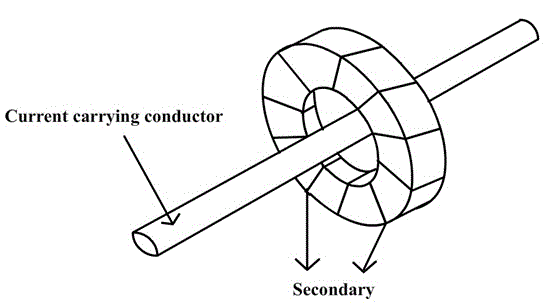](./images/normal37.png)

Fig (11)  
Line conductor acting as primary

The secondary winding consists of large number of turns of fine wire designed for either 5A or 1A rating. Thus a current transformer is a step up transformer. The current transformer has the secondary effectively short-circuited through the low impedance of the ammeter. The fig (h) below shows the current transformer connections.

[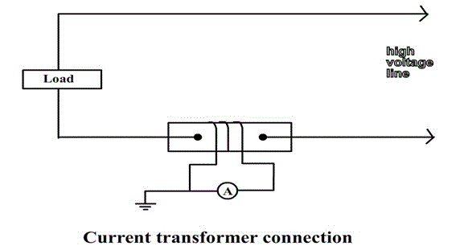](./images/normal38.png)

Fig (12)

The current transformer ratio is not equal to the ratio of secondary to primary turns, mainly because of the effect of magnetizing current.  
A current transformer must never be operated on open circuit for the following reasons:

<ul style="list-style-type: circle">
   <li>There will be no secondary m.m.f. and since the primary current(and m.m.f.) is fixed, the core flux will increase enormously. This will cause large amount of eddy current and hysteresis losses and the resulting high temperature may damage the insulation or even the core.</li> 
   <li>As the secondary side is open , a very high voltage will be induced in the multi-turn secondary and this high voltage is dangerous to both life and to the insulation.</li> 
</ul>

[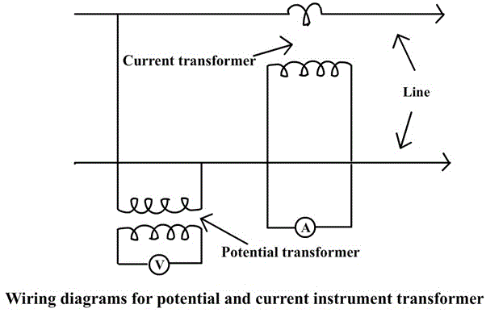](./images/normal39.png)

fig(13)

The above diagram shows the wiring diagram for potential and current instrument transformers.

<u>**Switch gear**</u>  
Switchgear is a term which covers wide range of equipment as regards switching and interrupting the currents in the power system during normal and abnormal conditions.

**Or**

The apparatus used for switching, controlling and protecting the electrical circuits and equipment is known as switchgear.  
"switchgear" in general consists of:

<ul style="list-style-type: circle">
   <li>switches</li>
   <li>fuses</li>
   <li>circuit breakers</li>
   <li>isolators</li>
   <li>relays</li>
   <li>control panels</li>
   <li>metering panels</li>
   <li>lighting arrestors</li>
   <li>current transformers</li>
   <li>potential transformers etc</li>
</ul>

<u>**Functions of switchgear**</u>

<ul style="list-style-type: circle">
   <li>To localise the effects of faults by operation of protective equipment and so automatically disconnect faulty point from the system.</li>
   <li>To break efficiently the short circuits without giving rise to dangerous conditions.</li>
   <li>To facilitate the redistribution of loads, inspection and maintainance on the system.</li>  
</ul>

<u>**Essential features of switchgear**</u>

<ul style="list-style-type: circle">
   <li>Complete reliability</li>
   <li>The switchgear must be able to discriminate between faulty and healthy sections.</li>
   <li>Quick operation</li>
   <li>Provision for manual control.</li>
   <li>Provision for instruments.</li>  
</ul>

<u>**Principles of layout of switchgear**</u>

<ul style="list-style-type: circle">
   <li>The layout should be such that any section may be isolated without immoderately affecting the service.</li>
   <li>There should be an easy and safe access for general routine inspection and for maintainance.</li>
   <li>The individual units should be so designed that the risks of failure are reduced to minimum.</li>
   <li>Fire protection arrangement must be made adequately.</li>
   <li>To keep the breaking duty within the capacity of the circuit breakers, reactors should be used wherever necessary.</li>   
</ul>

fig(14)

[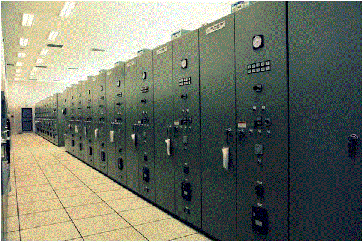](./images/normal41.png)

fig(15)

<u>**SF6 gas-insulated switchgear**</u>  
Gas-insulated switchgear (GIS) has become a major piece of substation equipment. Over the period, GIS has been improved by technological advancements that have increased the interrupting capacity of the circuit breaker (CB) and decreased the number of breaks per single CB without using an air condenser.  
GIS offers high reliability, safety, and maintenance-free features in a much smaller space compared with conventional switchgear.

[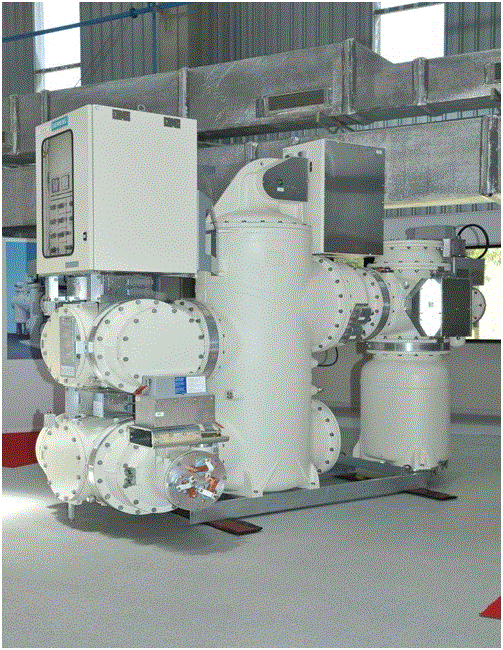](./images/normal42.png)

fig(16)

The SF6 GIS (fig(d)) guarantees outstanding advantages for the planning and operation of high-voltage supply networks. For instance , the space requirement can be less than 10% of the space taken up by an equivalent conventional installation.

[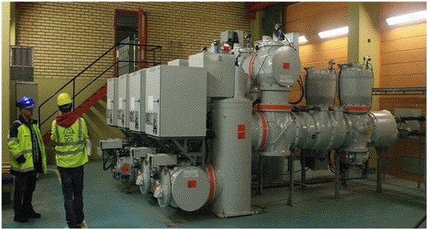](./images/normal43.png)

fig(17)

As all live parts are metal enclosed and hermetically sealed, the SF6 GIS is completely immune to atmospheric pollution (fog, sand, salt, etc.) and industrial pollution (dust, smoke, gas, etc.). With SF6 GIS, all foreign bodies (persons, animals, and tools) are prevented from coming into contact with live parts. This ensures maximum safety to personnel and increased continuity of operation.

<u>Main features</u>:  
<u>High reliability</u>: The live parts are sealed in metal enclosures filled with pure SF6 gas. Thus, the switch gear is protected from contamination by smoke, chemical fumes, dust or salt-laden spray or by the ingress of small animals. This protection prevents the inside components from oxidation and rust caused by oxygen and moisture.

<u>Space reduction</u>: A medium-voltage GIS can be installed into a space about half that required for conventional air-insulated metal-clad switchgear.

<u>High safety</u>: All the live parts are fully enclosed in grounded metal enclosures. Thus, there is no danger of an electrical shock.SF6 is an inert, non-flammable, nontoxic, and odourless gas used as an insulation and arc-extinguishing medium. Therefore, it is safe for personnel and there is no fire hazard.

<u>Short installation time</u>: A GIS of about four panels can be transported fully constructed. The GIS can be energized by connecting external power cables to the prefabricated plug-in type terminals, thus shortening installation time.

<u>**Relating PLC’s / DCS to substation automation**</u>  
The automation of any system reduces the human work and increase the efficiency. In the scope of industrialization, automation is a step beyond mechanization. Whereas mechanization provides human operators with machinery to assist them with muscular requirements of work, automation greatly decreases the need for human sensory and mental requirement as well.  
The concept of automation was largely “centralized” in late 90’s.The meaning of centralized here is central cubical housing a PLC-system and associated I/O modules where located at a specific location and all the equipment’s being controlled where hardwired to their central cubicle. Later this model evolved into “decentralized “pattern. Wherein the basic control remained with a centrally located PLC CPU system but remote PLC I/O stations were located close to the actual point of control/application were present and these were connected to the central PLC system through a deterministic communication link.  
The substation automation is done by using either Distributed control system(DCS) or a programmable logic controller(PLC) system. Today the demarcation between a PLC system and a DCS system is getting reduced as both have same functionality. DCS/PLC is the master or centralized controller for the process.

<u>Applications for DCS/PLC in substation automation and Supervisory control and data acquisition (SCADA)</u>  
Every device used in substation has a very important role in the substation for both proper working and protection issues. These devices can be monitored and controlled automatically using SCADA by using either PLC or DCS. The automation provides more efficiency in the process and reduces human dependency. In the supervisory control room, the status of all d equipment and its working will be displayed. In case of any faults, alarm will be generated in the supervisory control room, depending upon the severity of the problem either manual or automated (predefined) decisions will be taken place.

<u>Typical examples of application of PLC/DCS in substation</u>:

<ul style="list-style-type: circle">
   <li>Opening and closing of isolator.</li>
   <li>Opening and closing of circuit breaker.</li>
   <li>Changing the tap position of on load tap changer.</li>
   <li>Opening and closing of bus coupler.</li>
   <li>Data acquisition from almost all the equipment.</li>
   <li>Almost all the devices used can be monitored and controlled using PLC/DCS.</li>
</ul>

<u>**Timers**</u>

All PLC’s have timer instructions. Timers are output instructions that are internal to the programmable logic controller. Timers provide timed control of the devices that they activate or de-activate.

<u>Basic functions of timer</u>

<ul style="list-style-type: disc">
   <li>Timers are used to delay an action.</li>
   <li>Timers are used to run an operation for a predetermined period of time.</li>
   <li>Timers are also used to record the total accumulated time of continuous or intermediate events.</li>
</ul>

<u>**Timer’s instructions**</u>  
Timers consists of following parts: timer address, preset value, timer base, and accumulated value, as shown in figure below.

fig(a)

In the above figure , term instruction name is, timer on delay ( TON ), timer base is 1.0 seconds, timer address is T4:0, accumulated value of zero(0) and a preset value of 200.  
Each timer instruction has three very useful status bits. These bits are timer enable (E N), timer timing (TT), and timer done(DN).  
There are 3 types of timers: On- delay timer, Off-delay timer, and retentive timer.

<u>**On delay timer**</u>

<ul style="list-style-type: disc">
   <li>Use this instruction to program a time delay after instructions become true.</li>
   <li>On – delay timers are used when an action is to begin a specified time after the input becomes true. For example, a certain step in the manufacturing is to begin 45 seconds after a signal is received from a limit switch. The 45- seconds delay is the on-delay timers preset value.</li>
</ul>

<u>**Off- delay timer**</u>

<ul style="list-style-type: disc">
   <li>Off- delay timer instructions is used to program a time delay to begin after rung input goes false.</li>
   <li>As an example, when an external cooling fan on a motor is provided, the fan has to run all the time the motor is running and also for certain time (say 10min) after the motor is turned off. This is a ten minute off- delay timer. The ten-minute timing period begins as soon as the motor is turned off.</li>
</ul>

<u>**Retentive timer**</u>

<ul style="list-style-type: disc">
   <li>Retentive timer is a timer which retains the accumulated value in case of power loss, change of processor mode or rung state going from true to false (rung state transition).</li>
   <li>Retentive timer can be used to track the running time of a motor for its maintenance purpose. Each time the motor is turned off, the timer will remember the motor’s elapsed running time. The next time the motor is turned on, the time will increase from there. This timer can be reset by using a reset instruction.</li>
</ul>

<u>**Reset**</u>

<ul style="list-style-type: disc">
   <li>This instruction is used to reset the accumulated value of counter or timer.</li>
   <li>It is used to reset a retentive timer’s accumulated value to zero.</li>
</ul>

<u>A typical timer element</u>  
A timer element is made up of three 16 bit words:

<ul style="list-style-type: disc">
   <li>Word 0 → 3 status bits (EN, TT, DN).</li>
   <li>Word 1 → Preset values.</li>
   <li>Word 2 → Accumulated value.</li>
</ul>

fig(b)

<u>How do we address a timer?</u>  
Addressing a timer is as follows:

1. The address format in order to address the timer element is T4:3  
   Where, T = T identifies this as a timer file.  
   4 = represents the default timer file 4.  
   Note: SLC timer can be assigned any unused file from 9 to 255.  
   :3 = This is timer three in file 4. There are 256 timers available in each file. Timers 0 through 255 are available .

2. Preset value of the timer can be addressed in the following way:T4:3.PRE  
   Where, T= identifies this as a timer file.  
   4= represents the default timer file 4.  
   :3= timer 3 in file 4.  
   . = this point is the word delimiter. It separates the timer number, called the structure, from the subelements. Here the subelement is PRE, for preset value.

3. Accumulated value of the timer can be addressed as shown below:T4:3.ACC
   Where, T= identifies this as a timer file.  
   4= represents the default timer file 4.  
   :3= timer 3 in file 4.  
   . = this point is the word delimiter. It separates the timer number, called the structure, from the subelements. Here the subelement is ACC, for accumulated value.

⇒ The status bits of the timer can be addressed in the following way:

<li>Word zero, bit 13, is the done bit. It is identified as DN. This bit is set when the timer’s accumulated value is equal to the timer’s preset value. It can be addressed as T4:3/DN.  </li>
<li>Word zero, bit 14, is the timer timing bit. It is identified as TT. TT is set when the timer is timing. It is addressed as T4:3/TT.</li>  
<li>Word zero, bit 15, is the timer enable bit. It is identified as EN. EN bit is set whenever the timer is enabled. It is addressed as T4:3/EN.</li>

<u>**The on-delay timer instruction**</u>

[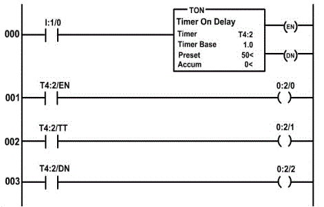](./images/timer3.png)

fig(c)

The above figure is used to explain the on-delay timer instruction.  
Here, T4:2 represents timer file 4, timer element 2, preset value is 50, accumulated value is 0 and timer base is 1 second. Input module is in slot 1 and output module is in slot 2.

<ul style="list-style-type: disc">
<li>As long as the instruction I:1/0 is true, the on-delay timer T4:2 will increment every one second toward its preset value of 50 seconds. The accumulated value displays the current number of seconds that passed. When the accumulated value is equal to the preset value, the timer’s done bit will get energized or set. So when the timer’s done bit gets energized, the rung 003, instruction T4:3/DN becomes true and logical continuity is passed and the output O:2/2 gets energized.</li>
<li>As long as the I:1/4 is true, the timer instruction is enabled. Hence, rung 000 becomes true and logical continuity is passed and the output O:2/0 is energized.    
Note: An on-delay timer is not retentive in nature.so any loss of continuity to the timer instruction on rung 000 will cause the timer to reset itself to an accumulated value of 0.</li>
<li>When the timer is timing i.e rung 000 is true and accumulated value is less than preset value, timer timing bit(TT) is true. So the rung 002 becomes true i.e instruction T4:2/TT is true and output instruction O:2/1 is energized.    
Note: As long as the rung 000 is true i.e instruction I:1/0 is true, the timer instruction is considered enabled. The enable bit will be true when the timer timing bit is true. Timer enable bit will be set through the transition from the timer-timing bit to the timer-done bit. Timer enable bit is set as long as there is logical continuity through all input instructions to the timer instruction, no matter the relationship between the preset value and accumulated value. When the rung goes false, the enable bit is reset.</li>
</ul>

<u>**The off-delay timer instruction**</u>

fig(d)

The above figure is used to explain the off-delay timer instruction. Here, T4:2 represents timer file 4, timer element 2, preset value is 200, accumulated value is 0 and timer base is 1 second. Input module is in slot 1 and output module is in slot 2.

<ul style="list-style-type: disc">
<li>As an example, consider an external cooling fan on a motor which has to run all the time when the motor is running and also for 200 seconds after the motor is turned off. For this purpose, we use 200- second off-delay timer. The 200-second timing cycle begins when the motor is turned off.</li>    
<li>When the instruction I:1/0 is true, the motor is turned on i.e instruction O:2/0 becomes true. In other words, rung 000 becomes true. When the instruction I:1/0 is true, rung 001 becomes true, which will make the off-delay timer T4:2 enable. So as long as the instruction I:1/0 is true, the timer enable bit, EN, is true and hence, rung 002 become true, which inturn makes the output instruction O:2/1 true. The done bit is set as long as the rung 001 is true i.e the done bit is set when the enable bit is set. So the rung 004 is true. Hence, the external cooling fan is energized i.e instruction O:2/3 is true. So at this point, both motor and external cooling fan are energized.</li>     
<li>When the motor is turned off, i.e the instruction I:1/0 becomes false, the output instruction O:2/0( motor) becomes false and motor is turned off. When rung 001 transitions from true to false, the TOF( off-delay timer) instruction begins timing. The done bit and the external cooling fan( O:2/3) will still remains on, or true, for the preset value of 200 seconds. The time period between the point when the rung becomes false and the point when the 200 seconds preset time expires for T4:2 is called delay after the input goes false, or the off-delay. The timers done bit and its associated output stay true until the off-delay of 200- seconds expires. The time expires when the accumulated value reaches the preset value. When the input instruction I:1/0 goes from true to false, the timer enable bit (EN) is reset and timer timing bit(TT) is set. The timer will start timing at this point. The timer timing bit(EN) becomes true whenever the rung transitions from true to false and the accumulated value is less than the preset value.    
Note: The timer done bit, bit 13, is set when the rung 000 becomes true. It will remain set through the true to false transition and until the accumulated value is equal to the preset value. This bit is commonly used to control the other logic when an output needs to be turned-on or turned-off after its rung has been off for the preset time interval.</li>
</ul>

<u>**The retentive timer instruction**</u>  
Retentive timer instruction is used when we want to retain the accumulated value through power loss, processor mode change, or change in the rung state from true to false. The retentive timer instruction will measure the cumulative time period for which its rung is true. One of the example of retentive timer is that, it can be used to track the running time of a motor for maintenance purpose. The retentive timer is used to track the accumulated time the motor has run. In our example , our motor needs maintenance after 3600 seconds or, one hour of running time. Each time the motor is turned off, the timer needs to remember the motors total elapsed running time. The next time the motor is turned on, the timer will increase the accumulated running time from where it is left off. When the total accumulated motor running time has been reached, a maintenance remainder pilot light will be lit. A retentive timer is used in this application.

fig(e)

Here, T4:2 represents timer file 4, timer element 2, preset value is 3600, accumulated value is 0 and timer base is 1 second. Input module is in slot 1 and output module is in slot 2.  
The retentive timer on, RTO instruction, behaves similar to the timer-on delay instruction, with exception that when the RTO instruction goes false, it will retain its accumulated value.  
The retentive timer will retain its accumulated value during the following conditions:

<ul style="list-style-type: disc">
<li>When its rung goes false.</li>
<li>When processor losses power. But, the battery for memory back up must be in good condition.</li>
<li>When the processor faults.</li>
<li>When the processor operating mode is changed from remote run or remote test to remote program mode.</li>
</ul>

<u>Associated status bit</u>  
The timer done bit, bit 13, is set when the accumulated value is equal to the preset value. For our application, the done bit and output O:2/0 could control the maintenance reminder pilot light.  
Timer timing bit(TT), bit 14, is on rung 002. This bit is set anytime the rung conditions are true and the timer times. The timer times whenever the rung is true and the accumulated value is less than the preset value. When the done bit is set, the timer timing bit resets. So in our example, the timer timing bit will be set or true, whenever input I:1/0 is true and as long as the accumulated value is less than the preset value of 3600 seconds. Output O:2/1 will be on or true when the timer is timing between 0 second and 300 seconds. As the done bit is set and O:2/0 turns on, the timer timing bit goes false and O:2/1 turns off.  
The timer enable bit, 15, is set or true , anytime the timer instruction rung 000 is true. As long as the instruction I:1/0 is true, the timer instruction is considered enabled. The enable bit is true when the timer-timing bit is true and it will stay set through the transition from the timer-timing bit to the timer done bit.

<u>The reset instruction</u>  
In order to reset the accumulated value of retentive timer, a reset instruction is used. The address of the reset instruction must match the address of the timer that is to be reset. Only one address is allowed per reset instruction. In rung 004, I:1/1 instruction is used to reset the timer T4:2. This signal comes from a momentary normally open push button field device, connected to input screw terminal 1. Pressing this push button will reset the RTO’s accumulated value back to 0.

NOTE: Retentive timer off instruction behaves similar to the timer-off delay with the exception that when the instruction goes from false to true, it will retain , or remember, its accumulated value.

